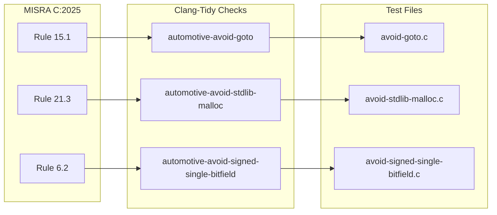
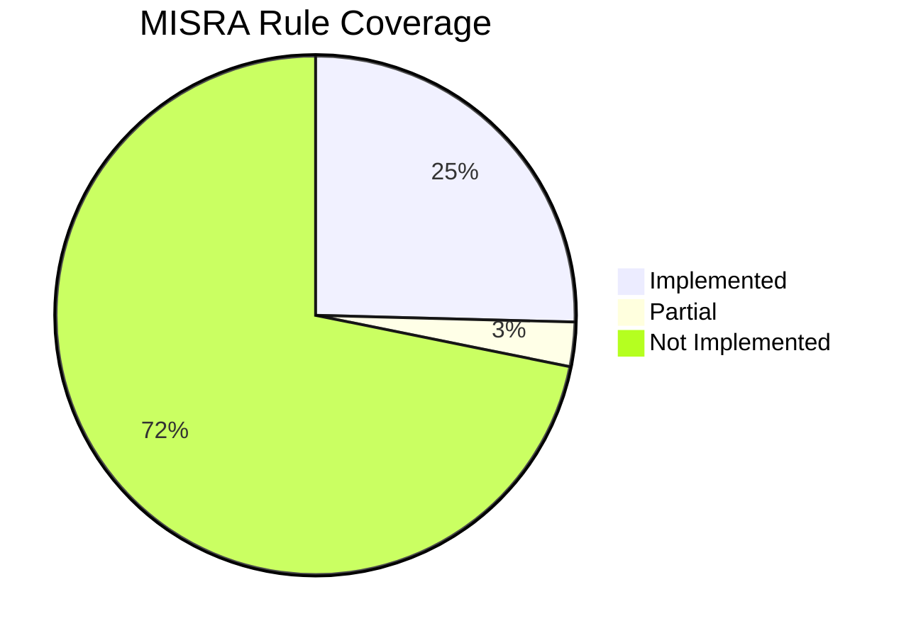

# Traceability Matrix
{: .no_toc }

Full mapping from MISRA rules to checks to tests.
{: .fs-6 .fw-300 }

## Table of Contents
{: .no_toc .text-delta }

1. TOC
{:toc}

---

## Overview



---

## Rule to Check Mapping

| MISRA Rule | Check ID | Test File | Status |
|:-----------|:---------|:----------|:-------|
| 2.4 | `automotive-unused-type` | `c2023/2.3/unused-type.c` | ✅ |
| 3.1 | `automotive-avoid-comment-within-comment` | - | ✅ |
| 3.2 | `automotive-avoid-line-splicing-within-comment` | `c2023/3.2/avoid-line-splicing.c` | ✅ |
| 6.1 | `automotive-wrong-bitfield-type` | `bitfield/wrong-bitfield-type.c` | ✅ |
| 6.2 | `automotive-avoid-signed-single-bitfield` | `bitfield/avoid-signed-single-bitfield.c` | ✅ |
| 7.1 | `automotive-avoid-octal-number` | `literal/avoid-octal-number.c` | ✅ |
| 7.3 | `automotive-avoid-lowercase-literal-suffix` | `literal/avoid-lowercase-literal-suffix.c` | ✅ |
| 8.1 | `automotive-implicit-int` | `type/implicit-int.c` | ✅ |
| 8.14 | `automotive-avoid-restrict-type` | `c2023/8.14/avoid-restrict-type.c` | ✅ |
| 15.1 | `automotive-avoid-goto` | `statement/avoid-goto.c` | ✅ |
| 15.5 | `automotive-avoid-multiple-return-stmt` | `return/multiple-return-stmt.c` | ✅ |
| 16.4 | `automotive-missing-default-in-switch` | - | ✅ |
| 17.7 | `automotive-missing-return-value-handling` | `return/missing-return-value-handling.c` | ✅ |
| 19.2 | `automotive-avoid-union` | `type/avoid-union.c` | ✅ |
| 19.2 | `automotive-avoid-bitfield-in-union` | `bitfield/avoid-bitfield-in-union.c` | ✅ |
| 21.3 | `automotive-avoid-stdlib-malloc` | `stdlib/avoid-stdlib-malloc.c` | ✅ |
| 21.4 | `automotive-avoid-setjmp-header` | - | ✅ |
| 21.5 | `automotive-avoid-signal-header` | `c2023/21.5/avoid-signal-header.c` | ✅ |
| 21.7 | `automotive-avoid-ascii-to-number` | `stdlib/avoid-atox.c` | ✅ |
| 21.8 | `automotive-avoid-stdlib-exit` | `stdlib/avoid-stdlib-exit.c` | ✅ |
| 21.24 | `automotive-avoid-stdlib-rand` | `stdlib/avoid-stdlib-rand.c` | ✅ |

---

## Coverage by Category



---

## Test Coverage

| Category | Checks | Tests | Coverage |
|:---------|:-------|:------|:---------|
| Statements | 10 | 10 | 100% |
| Standard Library | 8 | 6 | 75% |
| Preprocessor | 6 | 3 | 50% |
| Functions | 5 | 3 | 60% |
| Types | 4 | 4 | 100% |
| Bitfield | 3 | 3 | 100% |
| Literals | 3 | 3 | 100% |
| Return | 3 | 3 | 100% |
| Expression | 3 | 2 | 67% |

**Overall: 49 tests / 56 checks = 88%**

---

## Finding Mappings

### In Source Code

Each header file contains MISRA rule reference:

```cpp
/// @par MISRA C:2025 Rule 15.1
/// The goto statement should not be used.
```

### Using grep

```bash
# Find check for specific rule
grep -r "Rule 15.1" src/automotive/

# Find all rules in a category
grep -r "Rule: 21\." src/automotive/

# Find all Required rules
grep -r "Category: Required" src/automotive/
```

### Data Export

The `_data/misra_mapping.yml` file contains machine-readable mappings.

---

## Audit Trail

| Date | Change | Author |
|:-----|:-------|:-------|
| 2024-12-12 | Initial 56 checks documented | Auto-generated |
| 2024-12-12 | Added 18 new test files | Auto-generated |
| 2024-12-12 | Created traceability matrix | Auto-generated |
